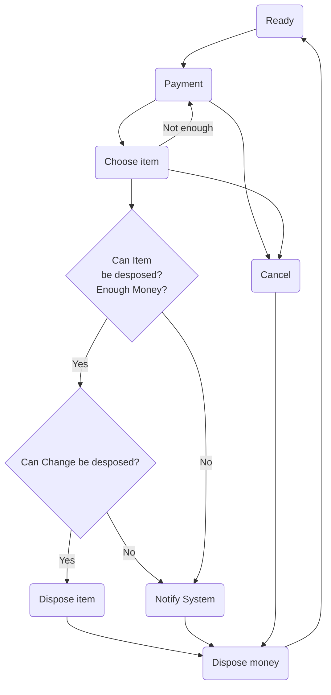
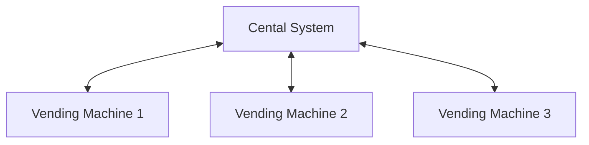
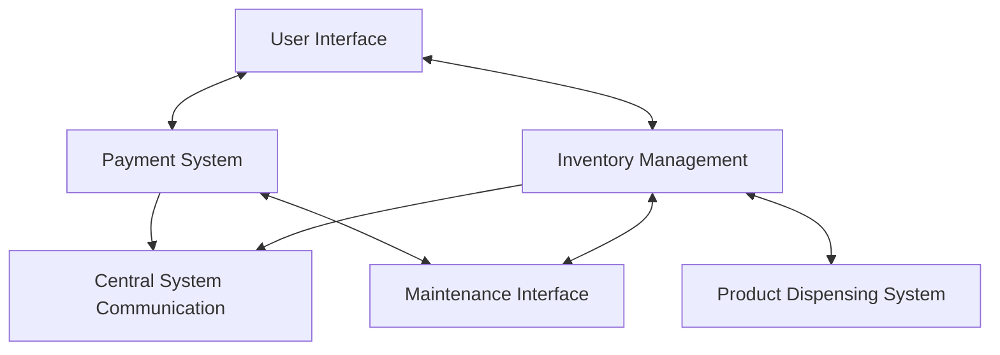

# Design a vending Machine system

## Functional Requirements

1. машина должна принимать различные номиналы (1, 10,100, 200, 500, 1000);
2. Интерфейс для выбора продукта (цифры, 45 -кола, 22 - шоколадка, и т.д.);
3. Отмена заказ - возврат денег
4. Сдача
6. Оповещение системы о том, что товар закончился
7. Oповещение о том, что закончилась сдача

# Overview Vending Machine States
## Operation States

## Maintanance State
 - add item
 - add coin (cash)

## Additional Functional requirements
- Central System should be able to get the items and cash info from the vending machine

## Non Functional Requirements
- Local Consistency:
    - Vending machine should always track the latest info about its state in order not to try to dispose the item which it has and return change, which it can not return
- Aviability:
    - This requirement can be slacked since vending machine is quite self-looped system
- Partiotion tollerence:
    - Every vending machine should be able to work idependetly from the central system

## High Level Design

  
## Vending machine High Level Design

  
- User Interface
    - User communicates with machine via User Interface
    - Connects to the Payment System  for handling payments.
    - Connects to the Inventory Management for product selection and availability display.
- Payment System
    - Communicates with the User Interface for payment processes.
    - Connects to the Maintenance Interface for maintenance and updates.
    - Reports to the Central System Communication for financial transaction logging.
- Product Dispensing System
    - Connects with Inventory Management for stock updates and dispensing actions.
- Inventory Management
    - Interacts with the User Interface for user selections.
    - Communicates with the Product Dispensing System for dispensing products and updating inventory.
    - Connects to the Maintenance Interface for restocking and inventory checks.
    -Reports inventory status to the Central System Communication.

- Central System Communication
    - Collects data from Inventory Management for inventory tracking.
    - Receives transaction reports from the Payment System.
    
- Maintenance Interface

    - Interacts with Inventory Management for managing stock and maintenance.
    - Communicates with the Payment System for updates and maintenance tasks.
---

## API Descriptions:

### User Interface:
1. Adding Money to the Balance
    - Endpoint: PUT /balance
    - Description: Adds money to the user's balance.
    - Request Body: JSON object containing the amount to be added.
    - Response: Updated balance and any relevant status messages.
2. Choosing an Item
    -   Endpoint: PUT /products/{id}
    - Description: Chooses an item based on its ID.
    -   Path Parameter: id (the ID of the product to be chosen).
    -   Request Body: Optional. Can include quantity or other parameters if needed.
    - Response: Confirmation of item selection, updated balance, and any relevant status messages.
3. Check Balance
    - Endpoint: GET /balance
    - Description: Retrieves the current balance.
    - Response: Current balance.
4. Cancel Transaction
    - Endpoint: POST /cancel
    - Description: Cancels the current transaction and returns the balance to the user.
    -   Response: Confirmation of cancellation and returned balance.
5. Retrieve Available Products
    -   Endpoint: GET /products
    -   Description: Retrieves a list of available products.
    -   Response: List of products with their IDs, names, prices, and stock status.

##